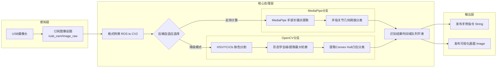

# 手势识别系统架构

以下是手势识别系统的代码处理流程图。
**查看方式**：在 VS Code 中，右键点击文件编辑器任意空白处，选择 **“打开预览” (Open Preview)**。如果您安装了 Mermaid 预览相关的插件（如 `Markdown Preview Mermaid Support`），即可直接看到生成的流程图像。

```mermaid
graph LR
    subgraph 感知层
        cam[USB摄像头]
        ros_sub[订阅图像话题<br>/usb_cam/image_raw]
    end

    subgraph 核心处理层
        img_conv[格式转换 ROS to CV2]
        backend{后端自适应选择}
        
        subgraph MediaPipe分支
            mp_infer[MediaPipe 手部关键点提取]
            mp_rule[手指关节几何阈值分类]
        end
        
        subgraph OpenCV分支
            cv_mask[HSV/YCrCb 肤色分割]
            cv_contour[形态学去噪/提取最大轮廓]
            cv_hull[提取Convex Hull凸包分类]
        end
        
        smooth[识别结果时间域队列平滑]
    end

    subgraph 输出层
        pub_result[发布手势指令 String]
        pub_image[发布可视化画面 Image]
    end

    cam --> ros_sub
    ros_sub --> img_conv
    img_conv --> backend
    
    backend -- "支持计算" --> mp_infer
    mp_infer --> mp_rule
    
    backend -- "降级模式" --> cv_mask
    cv_mask --> cv_contour
    cv_contour --> cv_hull
    
    mp_rule --> smooth
    cv_hull --> smooth
    
    smooth --> pub_result
    smooth --> pub_image
```
